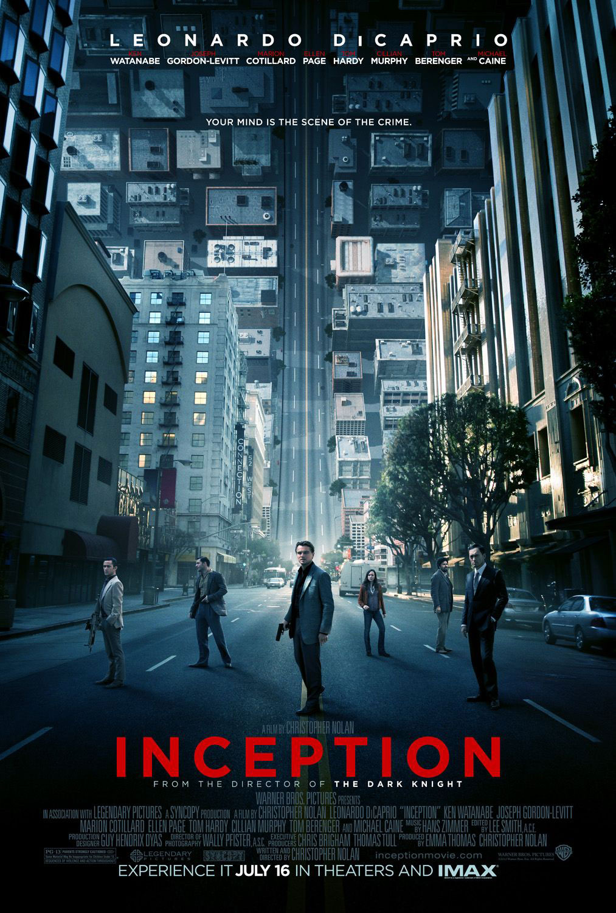
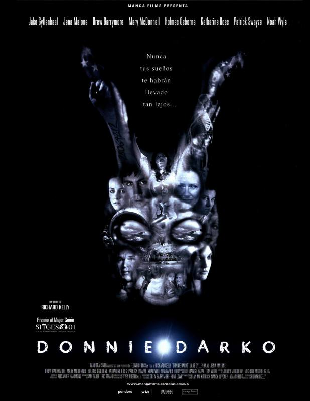
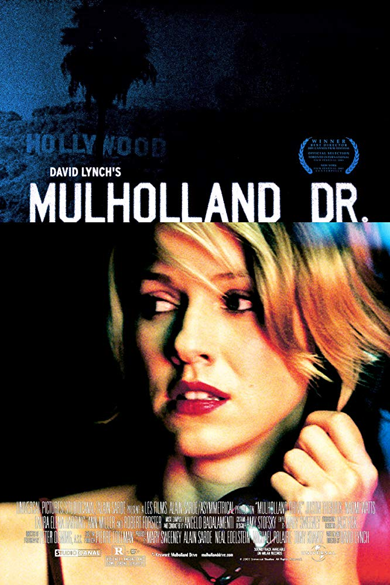
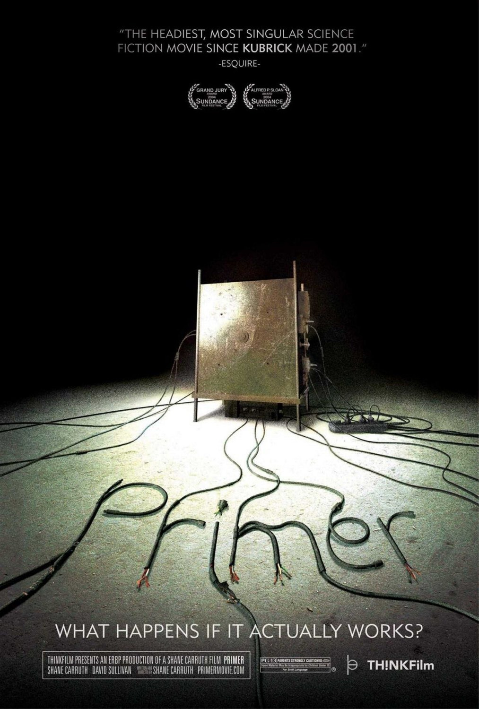

I **LOVE** mindblowing movies. 

I love a movie that forces you to think. Unpredictable plots, hard to comprehend storyline is my thing. Here are my top 5 mindblowing movies that really crippled my brain.

# 5. Inception

Dreams in dreams in dreams? Nolan never disappoints.

# 4. Donnie Darko

Creepy and cryptic. The movie loves to play with symbolism, hiding the true meaning with characters and hidden messages.

# 3. Mulholland Drive

David Lynch classic. It tells you a story of a woman living her successful broadway life. Or it is? 

# 2. 12 Angry Men

The plot was really clear. It's just the dialogs that blew my mind. I guess it's a low budget movie (only 2 shooting locations). Must watch!

# 1. Primer

If you have a friend that could understand what is going on right after he/she finishes watching this movie, he is probably lying. I had to rewatch the explanation video over and over to fully grasp what is going on in this movie. Time travel stuff. This is how a time travel science fiction movie should be made : puzzling.  

See you tomorrow!