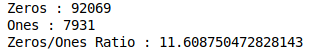
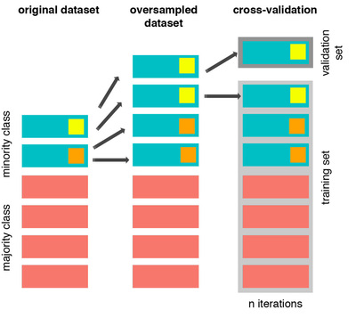

Hari ini hari yang sangat menjengkelkan buat gue.

Jadi untuk hari ini di *todo list* gue sudah gue tentuin untuk melakukan *preprocessing* suatu data yang gue pakai buat *research* gue. Salah satu yang harus gue lihat adalah distribusi *label* dari data yang gue gunakan. 

Bisa dilihat dari gambar di atas, *Zeros* menunjukkan jumlah data yang berlabel nol dan *Ones* menunjukkan jumlah data yang berlabel satu. Dari 100.000 data, rasio dari data yang berlabel nol dan berlabel satu adalah 11:1. Timpang banget. Pertanda bahwa datanya nggak *balance*. Oleh karena itu dibutuhkan sebuah proses yang namanya resampling. 

Resampling bisa dilakukan dengan dua cara: 

1. Upsampling
2. Downsampling

 

**Upsampling** adalah melakukan pengambilan sampel-sampel baru yang nantinya akan ditambahkan ke data. Sampel tersebut diambil dari kelas yang jadi minoritas. Dalam kasus ini berarti kelas yang minoritas adalah kelas 1. Jadi kelas 1 ini datanya akan "diduplikasi" (*more on this later*) agar jumlahnya nanti sama dengan jumlah data dari kelas yang mayoritas. 

**Downsampling** adalah kebalikan dari *upsampling.* Dia melakukan pemotongan data-data dengan kelas yang mayoritas (pada kasus ini kelas 0), sehingga jumlahnya akan sama dengan data yang minoritas. 

Untuk kasus gue, gue pakai upsampling. Kenapa? Karena berdasarkan yang gue baca, *downsampling* berpotensi untuk menghilangkan informasi yang ada pada data si kelas mayoritas itu. Akibat fatalnya nanti adalah *underfit*

Algoritma upsampling yang gue pakai adalah ***SMOTE***. Jujur belum terlalu paham kenapa. Tapi katanya ini teh udah *state-of-the-art* jadi gue percaya-percaya aja dulu. Untuk siapapun yang baca ini dan punya metode yang lebih baik dari *SMOTE* bisa banget kontak gue.

Nah kenapa gue kesel?

Jadi sebelum memakai data untuk model *machine learning* gue nanti, gue harus melakukan preprocessing dulu kan? Jadi setelah gue *upsampling* datanya, gue lakukan *cross-validation* untuk data yang udah di-*upsample* tadi, terus model gue jadi keren deh.  

Gue melakukan **resampling sebelum cross validation**. Kenapa ini bisa fatal? Mari kita baca tulisan yang bagus dari [sini](https://www.marcoaltini.com/blog/dealing-with-imbalanced-data-undersampling-oversampling-and-proper-cross-validation)

*`Now, if we do so before cross-validating, i.e. before we enter the leave one participant out cross-validation loop, we will be training the classifier using N-1 entries, leaving 1 out, but including in the N-1 one or more instances that are exactly the same as the one being validated. Thus, defeating the purpose of cross-validation altogether. Let's have a look at this issue graphically: `*

See? Dengan cara gue tadi *cross validation* seakan tak ada gunanya. Dan pantesan waktu itu model yang gue buat jadi bagus banget. *Overfit* bos. 

Karena gue baru sadar itu ketika *notebook preprocessing* gue udah kelar, gue baru akan revisi besok hari. Kzl.

*Source : [https://www.marcoaltini.com/blog/dealing-with-imbalanced-data-undersampling-oversampling-and-proper-cross-validation](https://www.marcoaltini.com/blog/dealing-with-imbalanced-data-undersampling-oversampling-and-proper-cross-validation)*

Sampai jumpa besok!