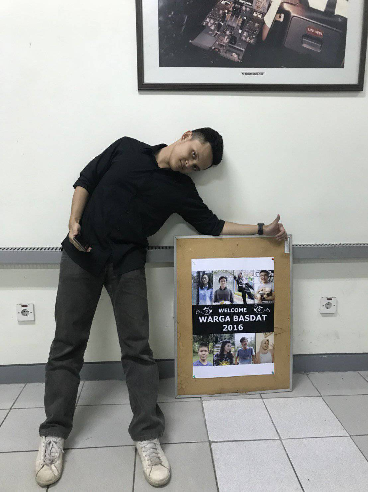

Everyone is making their own rewind so let me start my own. Here are my top moments and lessons that I got in 2018. 

## 1. Won My First Hackathon

It was my second hackathon. I decided to take part as the *project manager* and the *main speaker* of the team. The first few hours was really smooth. We got our work splitted into several parts and the team just worked it all out. But after a few hours, as my friends were getting tired and sleepy, I realized that if I didn't get my hands on the app directly (re: code), the app will not be finished at the designated time. I decided to take over the app and started coding. In this very time I realize that we have to be flexible and proactive when tackling real problems. 

For your info, I made an *e-commerce* app that aims to shorten the distribution chain of agriculture commodities. We used blockchain as the core feature of our app. See my [github](github.com/adylanrff) for further details! 

## 2. Tokopedia Internship

It was my first time I worked 9-5 in a startup environment. After a long adventure of applying here and there, I was lucky enough to be a part of this internship program for 3 months. I met a lot of amazing and inspiring friends, learn new things, adapt to a whole new environment. Not only the new tech stacks, but also the way I communicate with working partners, commitment, and being professional. Very cool!

## 3. Working Out and Eat Healthy 

I got bored when I was doing my job. It was a 9-5 work, in a very crowded J-town, and the office is quiet far from my home back then. So I decided to pursue something else. In those 3 months period, I regularly workout at the gym and track my calories to keep my body in shape. I had a target to lose 6 Kgs in the 3 months period. And turns out I lost 7 Kgs! Yeay! I guess if you have the guts and a right strategy to do something, you will finally achieve that target. 

## 4. Warga Basdat!

Honestly, at first I thought that I would give up the database laboratory assistant selection process. At that time, I already worked on the first part of the selection process. I was really busy at that time with research and the internship. But hey, there is nothing wrong with being an opportunity seeker, right? So at the D-1 of the deadline of the second part of the selection process, I worked on the task. And guess what? I managed to advance to the next process and finally got selected to join the database laboratory. Moral of the story: just do it!

## 5. Wisuda Oktober!

I realize that I was being too technical with my life. I realize that I had to fill some blank space in me. It was too imbalanced. So to fill that emptiness in myself, I was lucky enough to be the Head of The Event Section of the HMIF October Graduation. I learned a lot of new things here. I learned to communicate effectively with my partners and juniors. I also learned how to make targets, monitor tasks, and manage people to achive those targets. Very happy!

TL;DR: 2018 was great!